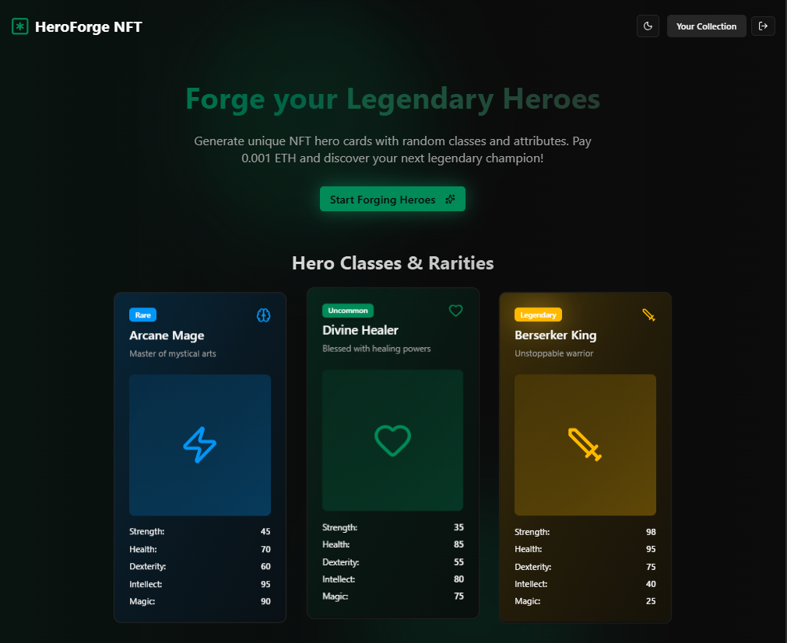

# HeroForge – ETH NFT Card Game (Sepolia Testnet Only)

HeroForge is an on-chain NFT card game prototype where every "Hero" is an ERC‑721 token with procedurally generated attributes and rarities. Players can mint heroes on Ethereum Sepolia testnet and view their collection in the frontend.

Important: This is a Sepolia testnet project ONLY. Do not use mainnet funds.

## What the smart contract lets you do

The core contract (Card.sol) is an ERC721Enumerable NFT with deterministic, on-chain generation at mint time:

- Mint a Hero NFT by paying the mint price (default 0.001 ETH on Sepolia).
- Each minted Hero includes:
  - Class: one of Warrior, Ranger, Mage, Healer, Rogue, Berserker, Shaman, Mindbender, Paladin, Warlock.
  - Rarity: Common, Uncommon, Rare, Epic, Legendary (weighted distribution).
  - Attributes: strength, health, dexterity, intellect, magic (rarity-scaled stats).
- Public read access to heroes[tokenId] to fetch a hero’s class, rarity, and stats.
- Owner controls:
  - setMintPrice(newPrice) to update mint price.
  - withdraw() to transfer the contract’s ETH balance to the owner.

Contract highlights:
- Standard: ERC-721 + Enumerable (OpenZeppelin)
- Deterministic randomness per tokenId seeded from block timestamp, minter, and tokenId

## Tech stack

Smart contracts:
- Solidity 0.8.x
- OpenZeppelin ERC721 + Enumerable
- Foundry toolchain (forge-std included) for development/testing

Frontend:
- Next.js + React + TypeScript
- wagmi + viem for wallet and contract interactions
- Deployed/configured for Sepolia chain only

Infra/Services:
- Etherscan (for contract verification/explorer links)
- Alchemy/Infura RPC (Sepolia)

## Deployment

Network: Sepolia testnet ONLY
- Contract name: Card (token name: HeroCard, symbol: HEROCARD)
- Address: 0xB6a2f7D56D173B38274EEd7FfAd0b040Afafa3bd
- Etherscan: https://sepolia.etherscan.io/address/0xB6a2f7D56D173B38274EEd7FfAd0b040Afafa3bd

Frontend is configured to use Sepolia via wagmi and reads this address from the project constants.

## Getting started (local)

Prerequisites:
- Node.js 18+
- pnpm or npm
- A Sepolia wallet with test ETH

1) Install frontend deps
- cd frontend
- npm install

2) Configure environment
- Ensure RPC URL and contract address are set for Sepolia. You can use the provided .env files as reference (frontend/.env and repo root .env). The project is already wired for Sepolia.

3) Run the frontend
- npm run dev and open the local URL shown in the terminal.

4) Connect wallet and mint
- Switch your wallet network to Sepolia.
- Use the Generate/Mint flow to create a new Hero (costs 0.001 Sepolia ETH per mint).

## Key folders

- contracts/ — Solidity sources (Card.sol) and Foundry tooling
- frontend/ — Next.js app, hooks, components

## Notes

- Sepolia Only: This project is intended exclusively for the Sepolia testnet. Mainnet is not supported.
- Costs: Minting requires 0.001 ETH on Sepolia (subject to change via setMintPrice).
- Randomness: Hero traits are derived from pseudo-randomness based on on-chain data at mint and are not suitable for security-critical randomness.

## License

MIT